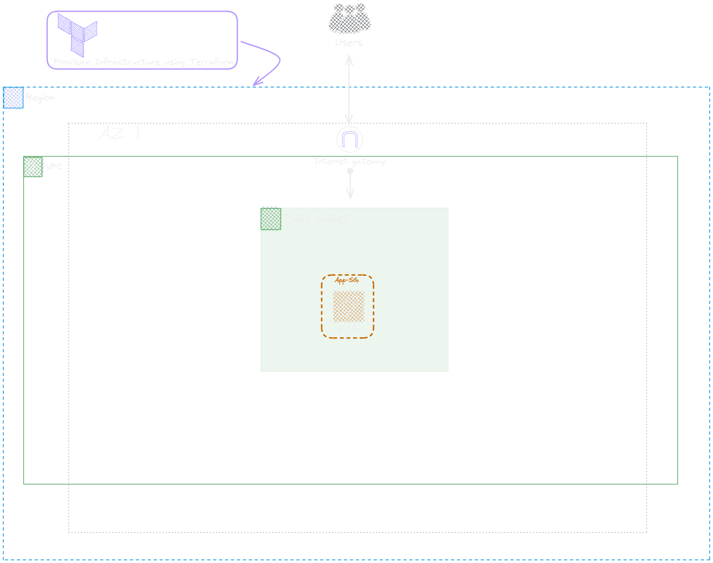

## SONARQUBE EC2 SERVER

### Diagram:


1. Connect to the SonarQube server through the browser. It uses port 9000.   
   `Note`: Port should be opened in the Security group 
   ```bash
   http://<Public-IP>:9000
   ```